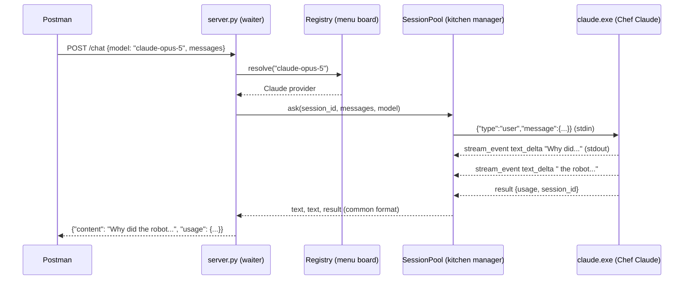

# How Switchboard AI Works — The Story of the Two Chefs

> **What is this?** This guide explains how `switchboard_ai` turns two editor extensions (the **Claude Code** extension and the **Antigravity** CLI) into a normal **REST API** that you can call from Postman. You don't need to be an expert. We start with a story, and then show the real thing.

---

## Contents

1. [The story](#1-the-story-the-restaurant-with-two-chefs)
2. [The problem we're solving](#2-the-problem-were-solving)
3. [Meet the characters (story ↔ real code)](#3-meet-the-characters)
4. [The journey of one request](#4-the-journey-of-one-request)
5. [The architecture map](#5-the-architecture-map)
6. [Superpowers: memory, warm stoves, spare chefs](#6-superpowers-memory-warm-stoves-and-spare-chefs)
7. [Streaming: food served bite by bite](#7-streaming-food-served-bite-by-bite)
8. [Agent mode: letting the chef into your kitchen](#8-agent-mode-letting-the-chef-into-your-kitchen)
9. [Safety rules](#9-safety-rules)
10. [Hands-on: calling it from Postman](#10-hands-on-calling-it-from-postman)
11. [Under the hood: what the chefs actually say](#11-under-the-hood-what-the-chefs-actually-say)
12. [Glossary](#12-glossary)
13. [Troubleshooting](#13-troubleshooting)

---

## 1. The story: the restaurant with two chefs

Imagine a small town with **two amazing chefs**.

🧑‍🍳 **Chef Claude** lives inside a kitchen called the **Claude Code extension** (in VS Code, Cursor or the Antigravity IDE). He cooks with Claude models like **Opus 5** and **Sonnet 5**.

🧑‍🍳 **Chef Agy** lives in another kitchen called the **Antigravity CLI**. She cooks with **Gemini**, **GPT‑OSS** and special "thinking" Claude models.

Both chefs are brilliant, and you've **already paid for their membership**: your Claude subscription and your Google/Antigravity account. There's one problem, though:

> The chefs only cook for people **standing right inside their kitchen** (your code editor or terminal).
> They don't have a phone. They don't take online orders. Your apps, your website, Postman — none of them can place an order.

So you build a **restaurant** in front of the two kitchens and hire a very smart **manager**. That manager is **Switchboard AI**.

Here's how the restaurant works:

1. 📱 A customer (**Postman**, your app, a website) sends an **order** to the restaurant's address: `http://localhost:8000`.
2. 🤵 The **waiter** (`server.py`) takes the order and checks it's written properly.
3. 📋 The **menu board** (the provider registry) looks at the dish name.
   - "Opus 5? That's Chef Claude's dish."
   - "Gemini 3.1 Pro? That's Chef Agy's."
4. 🧑‍🍳 The order goes to the right chef, **in the chef's own language**.
5. 🍽️ The chef cooks and sends the food back **bite by bite**.
6. 🤵 The waiter puts every bite on the **same kind of plate**, no matter which chef cooked it, and brings it to the customer.

The customer never has to know which kitchen the food came from. They just order from **one menu at one address**.

That's the whole idea. Everything else in this guide is detail.

---

## 2. The problem we're solving

| Without Switchboard AI | With Switchboard AI |
|---|---|
| Claude only works *inside* VS Code / Cursor / Antigravity IDE | Claude works from **anything** that can send HTTP: Postman, Python, JavaScript, mobile apps |
| Gemini (Antigravity) only works in its own terminal tool | Gemini is on the **same** API, at the same address |
| Two different tools, two different "languages" | **One** menu, **one** request format, **one** reply format |
| Using the official paid API costs extra per word | Uses the subscriptions you're **already signed in with** |

The trick: both extensions secretly ship a **command-line program**. Switchboard AI talks to those programs.

| Extension | Hidden program inside it | Where it lives on Windows |
|---|---|---|
| Claude Code extension | `claude.exe` | `%USERPROFILE%\.vscode\extensions\anthropic.claude-code-<version>\resources\native-binary\claude.exe` (or `.cursor`, `.antigravity-ide`, …) |
| Antigravity CLI | `agy.exe` | `%USERPROFILE%\.gemini\bin\agy.exe` |

These programs are **already logged in** to your account, because you signed in once in the editor. Switchboard AI simply runs them and talks to them.

---

## 3. Meet the characters

| In the story | In real life | File |
|---|---|---|
| The restaurant's address | `http://localhost:8000` | `config.py` (`API_HOST`, `API_PORT`) |
| The customer | Postman, your app, the web UI | — |
| The waiter | FastAPI web server | `server.py` |
| The menu board | Provider registry + model routing | `providers/__init__.py` |
| The talent scout who finds the chefs | Binary discovery | `discovery.py` |
| Chef Claude | `claude.exe` driver | `providers/claude.py` |
| Chef Agy | `agy.exe` driver | `providers/antigravity.py` |
| A chef's stove (kept hot) | A long-running CLI process | `process.py` → `ProcessSession` |
| The kitchen manager (who owns all the stoves) | Session pool | `process.py` → `SessionPool` |
| Your table number | `session_id` | sent in your request |
| The waiter who serves bites evenly | Stream smoothing | `pacing.py` |
| The restaurant's front window | Web UI | `static/index.html` |
| The rule book | Settings | `.env` / `config.py` |
| The front door | Command-line starter | `main.py` (`python -m switchboard_ai server`) |

---

## 4. The journey of one request

Let's follow **one order** from Postman all the way to Chef Claude and back.

**You send:**

```http
POST http://localhost:8000/chat
Content-Type: application/json

{
  "model": "claude-opus-5",
  "messages": [{ "role": "user", "content": "Tell me a joke about robots" }]
}
```

**What happens, step by step:**

```
 ┌──────────┐  ① HTTP POST /chat         ┌──────────────┐
 │ POSTMAN  │ ─────────────────────────► │  server.py   │  "the waiter"
 └──────────┘                            │  (FastAPI)   │  checks JSON + API key
                                         └──────┬───────┘
                                                │ ② "who cooks claude-opus-5?"
                                                ▼
                                         ┌──────────────┐
                                         │  registry    │  "the menu board"
                                         │ providers/   │  → Chef Claude
                                         └──────┬───────┘
                                                │ ③ chat(messages, model)
                                                ▼
                                         ┌──────────────┐
                                         │ SessionPool  │  "kitchen manager"
                                         │ process.py   │  takes a HOT stove
                                         └──────┬───────┘  (or lights one)
                                                │ ④ writes 1 JSON line to stdin
                                                ▼
                                         ┌──────────────┐
                                         │  claude.exe  │  "Chef Claude"
                                         │ (signed in)  │ ──► Anthropic's cloud
                                         └──────┬───────┘      (your subscription)
                                                │ ⑤ prints JSON lines to stdout
                                                ▼
                                         ┌──────────────┐
                                         │ claude.py    │  translates the chef's
                                         │ parser       │  words → common "plates"
                                         └──────┬───────┘
                                                │ ⑥ text / tool_use / result events
                                                ▼
 ┌──────────┐  ⑦ JSON reply              ┌──────────────┐
 │ POSTMAN  │ ◄───────────────────────── │  server.py   │  joins all the bites
 └──────────┘                            └──────────────┘  into one answer
```

The same journey as a sequence diagram (GitHub and VS Code's Markdown preview can draw this):



**If you pick a Gemini model**, the only thing that changes is step ②. The menu board says "Chef Agy", and steps ④ and ⑤ use agy's own language. Everything you see from the outside is identical.

---

## 5. The architecture map

```
switchboard_ai/
│
├── main.py            🚪 Front door: `python -m switchboard_ai server | status | ask`
├── config.py          📜 Rule book: reads .env (port, API key, tools, timeouts…)
├── discovery.py       🔍 Talent scout: finds claude.exe and agy.exe on this PC
│
├── server.py          🤵 Waiter: all the REST endpoints (FastAPI)
├── pacing.py          🥄 Serves streamed text evenly (no stutter)
├── process.py         🔥 Stoves + kitchen manager: warm processes, spares, memory
│
├── providers/
│   ├── __init__.py    📋 Menu board: which model → which chef
│   ├── base.py        📐 What every chef must be able to do + the common "plate" format
│   ├── claude.py      🧑‍🍳 Chef Claude: command line, input format, output parser
│   └── antigravity.py 🧑‍🍳 Chef Agy: command line, input format, output parser
│
└── static/index.html  🪟 The web UI (chat, agent, API docs, status)
```

The layers, from outside to inside:

```
        YOU (Postman / apps / web UI)
                   │  HTTP + JSON
   ┌───────────────▼────────────────┐
   │  server.py  — REST endpoints   │   /chat  /chat/stream  /agent/task
   │                                │   /models  /health  /v1/chat/completions
   ├────────────────────────────────┤
   │  providers/ — routing +        │   "claude-opus-5"        → Claude
   │  one translator per chef       │   "gemini-3.1-pro-high"  → Antigravity
   ├────────────────────────────────┤
   │  process.py — warm processes,  │   one stove per conversation,
   │  spares, memory, timeouts      │   one spare stove always hot
   ├────────────────────────────────┤
   │  claude.exe        agy.exe     │   the real programs from the extensions
   └───────┬──────────────┬─────────┘
           ▼              ▼
     Anthropic cloud   Google cloud     (your existing subscriptions)
```

### Chef finder: what happens at startup

When you run `python -m switchboard_ai server`:

1. 🔍 `discovery.py` searches for **claude.exe** in `.antigravity-ide`, `.antigravity`, `.vscode`, `.vscode-insiders`, `.cursor`, `.windsurf` and `~/.local/bin`. If it finds several, it picks the **newest version**.
2. 🔍 It searches for **agy.exe** in `~/.gemini/bin`, then your `PATH`, then `%LOCALAPPDATA%\Programs\Antigravity`.
3. 📋 Each chef found is marked **READY**. A missing one is marked **not found**.
4. 🔥 One **spare stove** is lit for each ready chef, so the first order is fast.
5. 📋 Chef Agy is asked "what can you cook?" (`agy models`) to get the live model list.

That's why it works with **both, one, or neither**:

| You have… | What happens |
|---|---|
| Both extensions | All ~24 models work |
| Only Claude Code | Claude models work; Gemini models answer "503 not installed" |
| Only Antigravity | Gemini/GPT‑OSS work; the default model automatically switches to a Gemini one |
| Neither | The server still starts, and `/health` tells you what to install |

---

## 6. Superpowers: memory, warm stoves, and spare chefs

### 🔥 Superpower 1: warm stoves

Starting a chef is **slow**. It's like lighting a cold stove:

| Chef | Cold start (new process) | Warm (process already running) |
|---|---|---|
| Chef Claude (`claude.exe`) | ~2 seconds | ~1.2 seconds |
| Chef Agy (`agy.exe`) | **~12 seconds** 🐢 | **~2 seconds** 🚀 |

So Switchboard AI **doesn't turn the stove off** after each order. The process keeps running, waiting for the next message.

### 🪑 Superpower 2: memory with `session_id` (your table number)

If you send `"session_id": "my-table-7"`:

- The first time, the manager gives table 7 **its own stove** (its own running process).
- Next time you come back with `"my-table-7"`, the **same chef** at the **same stove** serves you, and **he remembers what you said before**.
- So after the first message, Switchboard AI only sends your **newest** message. It doesn't resend the whole conversation, which makes follow-ups faster.

```
Order 1: {"session_id": "t7", "messages": [ "My name is Meet" ]}
         → Chef: "Nice to meet you, Meet!"
Order 2: {"session_id": "t7", "messages": [ ..., "What's my name?" ]}
         → Chef: "Meet!"   (he remembered — same stove, same chef)
```

With **no** `session_id`, every order is treated like a **new customer**. It's still fast, thanks to the spare chef.

### 🧑‍🍳 Superpower 3: the spare chef

After every order, the manager quietly **lights one extra stove** for the model you just used. The next new customer on that model gets a chef who's **already warmed up**.

### 🧹 Superpower 4: cleaning up

- A table that has been quiet for **15 minutes** (`SESSION_IDLE_TTL=900`) is cleared and its stove turned off.
- If you **cancel** halfway (the Stop button), that stove is thrown away. You can still send your next message with the same `session_id`: a new stove is lit, and the manager **replays the whole conversation** to the new chef so nothing is forgotten.
- If you **switch models** in the middle of a chat (Opus → Gemini), the new chef receives the full conversation too.

---

## 7. Streaming: food served bite by bite

Waiting 10 seconds for a whole meal is boring. With `/chat/stream`, the food comes **bite by bite** as it's cooked. This uses **Server-Sent Events (SSE)**: lines that start with `data:`.

```
data: {"type": "session", "provider": "claude", "model": "claude-opus-5"}
data: {"type": "text", "content": "Why did "}
data: {"type": "text", "content": "the robot go "}
data: {"type": "tool_use", "id": "t1", "name": "WebSearch", "detail": "robot jokes"}
data: {"type": "tool_result", "id": "t1", "ok": true, "content": ""}
data: {"type": "text", "content": "on vacation?..."}
data: {"type": "result", "usage": {"input_tokens": 12, "output_tokens": 40}}
data: {"type": "done"}
```

**The common plate:** both chefs speak different languages, but their translators (`claude.py`, `antigravity.py`) put everything on the **same plates**:

| Plate (`type`) | Meaning |
|---|---|
| `session` | "Your order was accepted by this chef" (sent first) |
| `text` | A bite of the answer |
| `tool_use` | "The chef is using a tool" (web search, reading a file…) |
| `tool_result` | "The tool finished" (`ok: true` or `false`) |
| `notice` | A heads-up, e.g. "that tool was blocked" |
| `result` | The bill: token usage, time taken |
| `error` | Something went wrong |
| `done` | "That's the whole meal" (sent last) |

**The even-serving waiter (`pacing.py`):** the chefs actually send bites in **clumps**. Claude was measured sending about 121 letters every 0.3 s, which looks jumpy. The waiter re-slices the clumps into small, even pieces every 25 ms, so the text flows smoothly. You can turn this off with `SMOOTH_STREAM=0`.

---

## 8. Agent mode: letting the chef into your kitchen

Normal chat is like ordering food. **Agent mode** is like letting the chef **into your own kitchen** (a folder on your PC) to actually **do work** there: read files, write files, fix code.

```http
POST http://localhost:8000/agent/task
{
  "task": "Read notes.txt and write todo_count.txt with the number of TODO lines",
  "model": "claude-sonnet-5",
  "working_dir": "C:\\Projects\\my-app"
}
```

The reply tells you what the chef did:

```json
{
  "content": "Done! I found 2 TODO lines and wrote the count to todo_count.txt.",
  "tools": [
    {"name": "Read",  "detail": "C:\\Projects\\my-app\\notes.txt",      "ok": true},
    {"name": "Write", "detail": "C:\\Projects\\my-app\\todo_count.txt", "ok": true}
  ],
  "native_session_id": "6500d847-…"
}
```

**To continue the same job**, send `"resume": "<that native_session_id>"` with the **same** `working_dir`. The chef remembers what he already did.

| Chef | What he's allowed to use in your kitchen |
|---|---|
| Claude | Only the tools in `AGENT_ALLOWED_TOOLS` (default: Read, Glob, Grep, Write, Edit, WebSearch, WebFetch). A request can **remove** tools, never **add** new ones. |
| Agy | "accept-edits" mode: can read and edit files, but **cannot run commands**. |
| Both | Shell commands (`Bash`) only if you set `AGENT_ALLOW_SHELL=1`. That's the "sharp knives" switch. |

---

## 9. Safety rules

The restaurant has a few important rules:

| Rule | Why | Setting |
|---|---|---|
| 🏠 By default, only **your own PC** can visit the restaurant | So strangers on your Wi‑Fi can't use your subscription | `API_HOST=127.0.0.1` |
| 🔑 You can require a **secret password** | Needed if you ever open it to other machines | `API_KEY=...` (then send `Authorization: Bearer <key>`) |
| 🥄 In normal chat, chefs can only **look things up** (web search), not touch files | Chat should never change your computer | `CHAT_ALLOWED_TOOLS=WebSearch,WebFetch` |
| 🔪 No shell commands unless you really mean it | A shell can do *anything* on your PC | `AGENT_ALLOW_SHELL=0` |
| 📁 Agents can be fenced into certain folders | So a task can't wander into `C:\Windows` | `AGENT_ALLOWED_ROOTS=C:\Projects` |
| 🙅 Never share `.env` or `~/.claude/.credentials.json` | They contain your login secrets | — |

> 💡 **A fair-use note.** This runs on **your personal subscriptions**. Using it yourself, on your own PC, is the intended scenario. Turning it into a public service for other people can break the providers' terms of service. For that, use the official paid APIs.

---

## 10. Hands-on: calling it from Postman

### Step 0 — Start the restaurant

Open a terminal in `C:\Users\<you>\Downloads\multi_agent_system` (the folder that **contains** `switchboard_ai`):

```powershell
venv\Scripts\activate
pip install -r switchboard_ai\requirements.txt      # first time only
python -m switchboard_ai status                     # which chefs were found?
python -m switchboard_ai server                     # open for business on port 8000
```

Or just double-click **`switchboard_ai\start.bat`**.

Check it's alive by opening **http://localhost:8000** in a browser. You'll see the web UI.

> ⚠️ The server **also** serves the web UI. There's no separate "frontend" to start.

### Step 1 — See the menu

| Postman field | Value |
|---|---|
| Method | `GET` |
| URL | `http://localhost:8000/models` |

Each model has an `id` (like `claude-opus-5`) and a `key` (like `claude:claude-opus-5`).

### Step 2 — Order from Chef Claude (Opus 5)

| Postman field | Value |
|---|---|
| Method | `POST` |
| URL | `http://localhost:8000/chat` |
| Body | **raw** → **JSON** |

```json
{
  "model": "claude-opus-5",
  "messages": [{ "role": "user", "content": "Explain black holes in 2 sentences." }]
}
```

Click **Send**. The answer is in the `"content"` field.

### Step 3 — Order from Chef Agy (Gemini)

Same URL, same body, but change **only** the model:

```json
{
  "model": "gemini-3.1-pro-high",
  "messages": [{ "role": "user", "content": "Explain black holes in 2 sentences." }]
}
```

> 🍴 **Same dish name, two chefs?** `claude-sonnet-4-6` exists in **both** kitchens. Without a prefix it goes to Chef Claude. For Chef Agy's version, write `"antigravity:claude-sonnet-4-6"`.

### Step 4 — A conversation with memory

Send these **one after another**, with the **same** `session_id`:

```json
{ "model": "claude-opus-5", "session_id": "postman-1",
  "messages": [{ "role": "user", "content": "My favourite colour is teal." }] }
```

```json
{ "model": "claude-opus-5", "session_id": "postman-1",
  "messages": [{ "role": "user", "content": "What's my favourite colour?" }] }
```

→ `"Teal!"` 🎉

### Step 5 — Extra options

```json
{
  "model": "claude-opus-5",
  "effort": "high",
  "messages": [
    { "role": "system", "content": "You are a pirate. Answer like one." },
    { "role": "user",   "content": "How do rainbows form?" }
  ]
}
```

- **`effort`** = how hard the model thinks: `low | medium | high` (Claude also `xhigh | max`).
- A **`system`** message gives the model personality or rules.

### Step 6 — Streaming

Change the URL to `http://localhost:8000/chat/stream` and keep the same body. Postman shows each `data: {...}` event as it arrives.

### Step 7 — OpenAI style (for tools that "speak OpenAI")

| Field | Value |
|---|---|
| URL | `http://localhost:8000/v1/chat/completions` |
| Body | `{"model": "claude-opus-5", "messages": [{"role": "user", "content": "Hi"}]}` |

The answer comes back at `choices[0].message.content`, exactly like OpenAI's API. That means the official **OpenAI Python/JS SDK** works too:

```python
from openai import OpenAI
client = OpenAI(base_url="http://localhost:8000/v1", api_key="not-needed")
r = client.chat.completions.create(model="claude-opus-5",
                                   messages=[{"role": "user", "content": "Hi"}])
print(r.choices[0].message.content)
```

### Step 8 — Import everything into Postman at once

In Postman, go to **Import → Link** and paste `http://localhost:8000/openapi.json`. You get a ready-made collection with every endpoint and example bodies.

### All endpoints at a glance

| Method | URL | What it does |
|---|---|---|
| GET | `/health` | Is the restaurant open? Which chefs are ready? |
| GET | `/providers` | Details about each chef |
| GET | `/models` | The full menu |
| POST | `/chat` | Order → full answer at once |
| POST | `/chat/stream` | Order → answer bite by bite (SSE) |
| POST | `/agent/task` | Let a chef work in a folder → full report |
| POST | `/agent/task/stream` | Same, live (SSE) |
| GET | `/sessions` | Which stoves are hot right now |
| DELETE | `/sessions/{id}` | Turn off one table's stove |
| GET | `/v1/models` | Menu in OpenAI format |
| POST | `/v1/chat/completions` | Order in OpenAI format |
| GET | `/docs` | Interactive documentation (Swagger) |
| GET | `/` | The web UI |

If `API_KEY` is set: in Postman's **Authorization** tab, choose **Bearer Token** and paste the key. (The header `X-API-Key: <key>` also works.)

---

## 11. Under the hood: what the chefs actually say

This part is for when you're curious about the **real** conversation between Switchboard AI and the programs.

### How each chef is started

**Chef Claude**, a long-running chat process:

```text
claude.exe -p --input-format stream-json --output-format stream-json
           --verbose --include-partial-messages --model claude-opus-5
           --allowedTools WebSearch,WebFetch
```

**Chef Agy**, a long-running chat process:

```text
agy.exe -p= --input-format stream-json --output-format stream-json
        --disable-slash-commands --model gemini-3.1-pro-high
```

(`-p=` with an equals sign is on purpose: agy's `-p` expects a value, and here the prompt comes from stdin instead.)

### What Switchboard AI writes into the chef's ear (stdin)

One JSON line per message. The two chefs want **slightly different** words:

```jsonc
// Chef Claude
{"type": "user", "message": {"role": "user", "content": [{"type": "text", "text": "Hi!"}]}}

// Chef Agy
{"event": "user", "message": {"role": "user", "content": [{"type": "text", "text": "Hi!"}]}}
```

### What the chefs say back (stdout), and how it's translated

**Chef Claude** says:

```jsonc
{"type":"stream_event","event":{"type":"content_block_delta","delta":{"type":"text_delta","text":"Hel"}}}
{"type":"stream_event","event":{"type":"content_block_start","content_block":{"type":"tool_use","name":"WebSearch"}}}
{"type":"assistant","message":{...the complete message...}}
{"type":"result","result":"Hello!","usage":{...},"session_id":"6500d847-..."}
```

**Chef Agy** says:

```jsonc
{"event":"step_update","step_update":{"step_type":"agent_response","state":"ACTIVE","text_delta":"Hel"}}
{"event":"step_update","step_update":{"step_type":"tool","state":"ACTIVE","tool_name":"view_file"}}
{"event":"result","result":{"status":"SUCCESS","response":"Hello!","conversation_id":"76772702-..."}}
```

**The translators turn both into the same plates:**

| Chef says | Plate you get |
|---|---|
| Claude `text_delta` / Agy `text_delta` | `{"type": "text"}` |
| Claude `content_block_start: tool_use` / Agy `step_type: tool, ACTIVE` | `{"type": "tool_use"}` |
| Claude `tool_result` / Agy tool `DONE` or `ERROR` | `{"type": "tool_result"}` |
| Claude `result` / Agy `result` | `{"type": "result"}` |

One small trick: Claude sends the answer **twice**, first as bites (deltas) and then as the complete message. The translator remembers which bites it already served, so you never get the answer twice.

---

## 12. Glossary

| Word | Simple meaning |
|---|---|
| **API** | A way for one program to ask another program to do something |
| **REST API** | An API you call over the web with URLs like `/chat`, using methods like GET and POST |
| **Endpoint** | One "door" of the API, e.g. `POST /chat` |
| **JSON** | The text format used for orders and answers: `{"key": "value"}` |
| **Postman** | An app for sending test requests to APIs |
| **CLI** | Command-Line Interface: a program you run in a terminal (`claude.exe`, `agy.exe`) |
| **Binary / .exe** | The actual program file |
| **Provider** | One chef: Claude Code or Antigravity |
| **Model** | The specific "brain", e.g. Opus 5, Gemini 3.1 Pro |
| **Process** | A running program. A "warm process" is one kept running |
| **stdin / stdout** | A program's ear (input) and mouth (output) |
| **Session** | A conversation that is remembered between messages |
| **Streaming / SSE** | Sending the answer piece by piece while it's being written |
| **Token** | A small chunk of text (about ¾ of a word) that models count and bill by |
| **Effort** | How long the model thinks before answering |
| **Agent** | A model that can use tools (read or write files, search the web) to finish a task |
| **FastAPI** | The Python library the waiter (`server.py`) is built with |
| **localhost** | "This same computer" |
| **Port 8000** | The restaurant's door number on your computer |

---

## 13. Troubleshooting

| Symptom | What it means | Fix |
|---|---|---|
| Web UI says **"Backend offline"** or stuck on "Loading…" | The restaurant isn't open | Run `python -m switchboard_ai server`, then open `http://localhost:8000` |
| Postman: **"Could not send request / ECONNREFUSED"** | Same: server not running, or wrong port | Start the server; check the port in the startup banner |
| **404 Not Found** | Wrong URL | It's `/chat`, not `/api/chat` or `/api/v1/...` |
| **400 Unknown model** | Typo in the model name | Check `GET /models` for exact ids |
| **503 … not installed** | That chef wasn't found | Install that extension/CLI, or set `CLAUDE_BINARY_PATH` / `AGY_BINARY_PATH` in `.env` |
| **401 / 403** | Server has an `API_KEY` | Add `Authorization: Bearer <key>` in Postman |
| **422 Unprocessable** | Body isn't valid JSON, or `messages` is missing | Body → raw → **JSON**; include `messages` |
| First reply is slow | The stove was cold (especially agy, ~12 s) | Normal. Later replies on the same model are much faster |
| `notice: "... was blocked"` | The chef tried a tool that isn't allowed | Expected in chat. For agents, see `AGENT_ALLOWED_TOOLS` |
| Claude answers "please log in" | `claude.exe` isn't signed in | Open the Claude Code extension once and sign in |

---

### The whole thing in one sentence

> **Switchboard AI is a restaurant manager.** It finds the chefs hiding inside your Claude Code and Antigravity extensions, keeps their stoves hot, takes orders from anyone at `http://localhost:8000`, sends each order to the right chef in that chef's own language, and serves every answer on the same kind of plate. That's how two editor extensions become one REST API you can call from Postman. 🍽️
