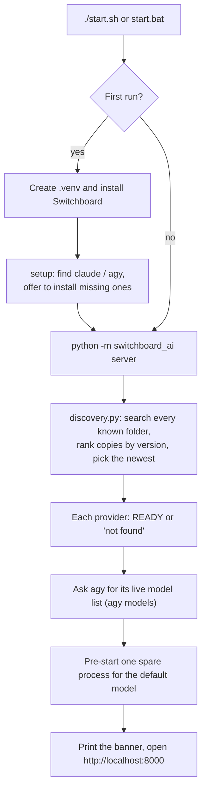
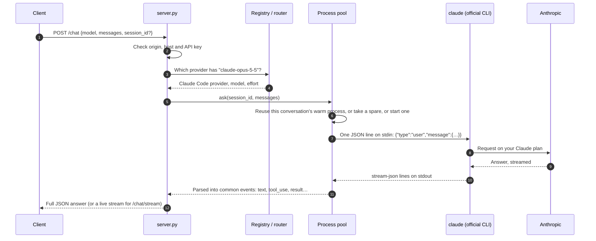
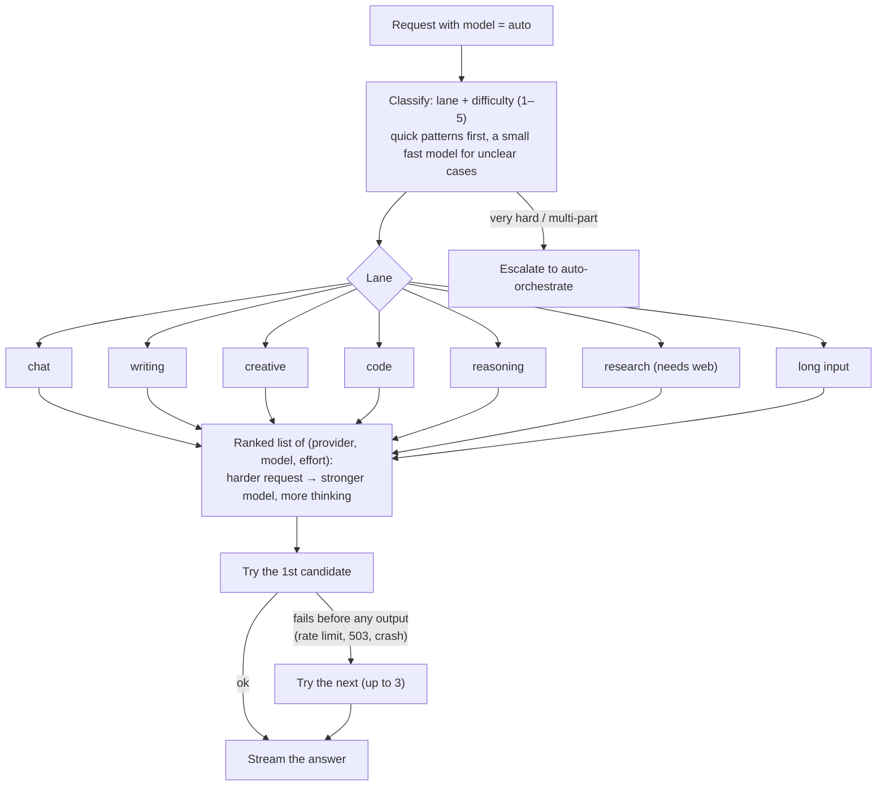
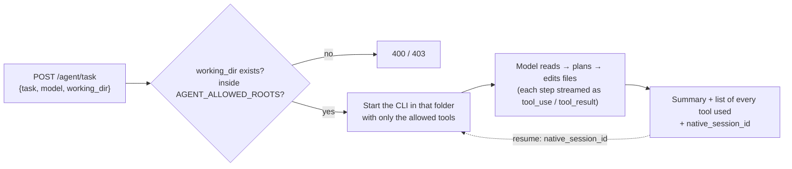
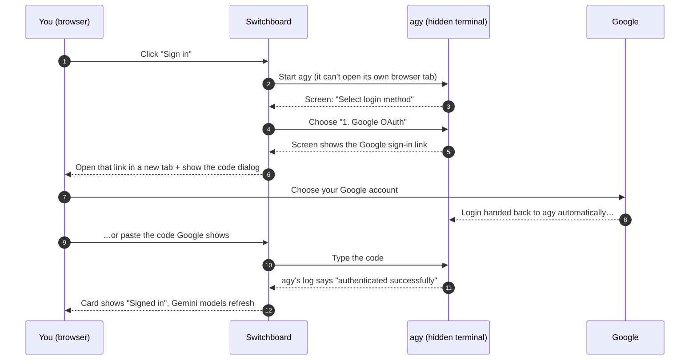

# Switchboard AI

**One local REST API and web UI for the Claude Code and Antigravity CLIs you already pay for.**

Switchboard AI runs on your own computer (Linux, macOS or Windows). It finds the official `claude` (Claude Code) and `agy` (Antigravity CLI) programs, keeps them running in the background, and puts all their models (Claude, Gemini, GPT-OSS) behind **one address**: `http://localhost:8000`. You can chat in the browser, call it from Postman, Python or JavaScript, or use any OpenAI-compatible client.

> [!WARNING]
> **Personal, local, testing and learning use only.** Switchboard AI drives your *consumer* subscriptions (Claude Pro/Max, Google AI Pro/Ultra). Both providers restrict how those subscriptions may be used by third-party tools, and Google has suspended paying users for it. **Read [Terms of service and ban risk](#terms-of-service-and-ban-risk) before you use it.** Never use it commercially, never share it with other people, and never resell access. You use it at your own risk.

---

## Contents

1. [The idea](#the-idea)
2. [What it costs (subscription vs API)](#what-it-costs-subscription-vs-api)
3. [Usage limits (quota)](#usage-limits-quota)
4. [Terms of service and ban risk](#terms-of-service-and-ban-risk)
5. [Models](#models)
6. [Setup](#setup)
7. [Using it](#using-it)
8. [How it works](#how-it-works)
9. [Where your credentials live](#where-your-credentials-live)
10. [Security](#security)
11. [Configuration](#configuration)
12. [Troubleshooting](#troubleshooting)
13. [Project layout](#project-layout)
14. [Disclaimer](#disclaimer)

---

## The idea

If you already pay for **Claude Pro/Max** and/or **Google AI Pro/Ultra**, you have access to strong models. But you can only use them *inside* their own apps: the Claude Code CLI or IDE extension, and the Antigravity CLI. Your own scripts, Postman and other apps can't use them unless you also buy **API access**, which is billed per token on top of the subscription.

Switchboard AI is a small local server in front of those two official CLIs:

```text
 your browser / Postman / scripts / OpenAI SDK
                 │   HTTP  (localhost:8000)
                 ▼
          ┌──────────────┐
          │ Switchboard  │  one API, one request format, one reply format
          └──┬────────┬──┘
             │        │
     ┌───────▼──┐  ┌──▼───────┐
     │  claude  │  │   agy    │   official CLIs, signed in with
     │ (Claude  │  │ (Antigr- │   your own subscriptions
     │  Code)   │  │  avity)  │
     └───────┬──┘  └──┬───────┘
             ▼        ▼
        Anthropic   Google
```

- **No extra API bill.** Requests count against your existing plan's usage limits, not a per-token invoice.
- **Both, either or neither.** Switchboard works with whichever CLI is installed. A missing one shows as "not installed" and never breaks the other.
- **Not a hack of the models.** Switchboard never talks to Anthropic or Google directly. It runs the unmodified official programs, the same way you would in a terminal.

---

## What it costs (subscription vs API)

### The subscriptions (monthly, USD)

| Plan | Price | Usage you get |
|---|---|---|
| **Claude Pro** | $20 | Base limit, resets every 5 hours plus a weekly cap |
| **Claude Max 5x** | $100 | 5× Pro |
| **Claude Max 20x** | $200 | 20× Pro |
| **Google AI Pro** | $20 | Base Antigravity quota (5-hour refresh plus weekly limit) |
| **Google AI Ultra** | $100 | 5× Pro |
| **Google AI Ultra (top tier)** | $200 | 20× Pro |

Sources: [Claude plans](https://intuitionlabs.ai/articles/claude-pricing-plans-api-costs), [Google's Antigravity plan changes, May 2026](https://antigravity.google/blog/changes-to-antigravity-plans). Google now draws Antigravity quota down "according to API pricing", so expensive models use up your quota faster. See [Usage limits](#usage-limits-quota) for how the limits work and how to check them.

### What the same usage would cost on the pay-per-token APIs

Official list prices in USD per **1 million tokens** (input / output). A token is roughly ¾ of a word.

| Model | Input | Output |
|---|---|---|
| Claude Fable 5.1 / Fable 5 | $10.00 | $50.00 |
| Claude Opus 5.5 | $4.00 | $20.00 |
| Claude Opus 5 / 4.8 / 4.7 / 4.6 | $5.00 | $25.00 |
| Claude Sonnet 5 | $2.00 | $10.00 |
| Claude Sonnet 4.6 | $3.00 | $15.00 |
| Claude Haiku 4.5 | $1.00 | $5.00 |
| Gemini 3.8 / 3.7 / 3.6 Flash | $0.75* | $3.75* |
| Gemini 3.1 Pro | $2.00 | $12.00 |

\*Google's price until 31 Dec 2026; Google says it doubles on 1 Jan 2027. Sources: [Anthropic pricing](https://platform.claude.com/docs/en/about-claude/pricing), [Gemini API pricing](https://ai.google.dev/gemini-api/docs/pricing).

### Worked examples

Assumptions: a **chat** = 3,000 input + 800 output tokens. An **agent task** (reading and editing files over several steps) = 60,000 input + 6,000 output tokens. A month = 30 days.

**Cost per request at API prices**

| Model | One chat | One agent task |
|---|---|---|
| Claude Opus 5.5 | $0.028 | $0.36 |
| Claude Sonnet 5 | $0.014 | $0.18 |
| Claude Haiku 4.5 | $0.007 | $0.09 |
| Gemini 3.8 Flash | $0.005 | $0.07 |
| Gemini 3.1 Pro | $0.016 | $0.19 |

**Monthly comparison**

| Profile | Usage per day | API cost / month | Subscriptions that cover it | You save |
|---|---|---|---|---|
| **Light** | 30 Sonnet 5 chats + 30 Gemini Flash chats | **≈ $17** | Claude Pro + Google AI Pro = $40 | **Nothing.** At this level the API is cheaper. |
| **Regular** | 100 Sonnet 5 chats + 100 Gemini Flash chats + 10 Sonnet 5 agent tasks | **≈ $112** ($42 + $16 + $54) | Claude Pro + Google AI Pro = $40 *(if it fits the limits)* | **≈ $72 / month** |
| **Heavy** | 100 Opus 5.5 chats + 20 Opus 5.5 agent tasks + 100 Gemini 3.1 Pro chats | **≈ $347** ($84 + $216 + $47) | Claude Max 5x + Google AI Pro = $120 | **≈ $227 / month** |

How to read this:

- **Subscriptions only win with heavy use.** For light use, pay-per-token is cheaper.
- **Limits are the real cap.** A Pro plan can run out in the middle of a busy afternoon (5-hour window) or late in the week (weekly cap). Then you wait or upgrade. The API never runs out, it just bills.
- **These are estimates.** Thinking tokens count as output and can multiply the output cost. Prompt caching can cut input cost by up to 90%. Agent tasks vary a lot.
- **Claude Fable 5 / 5.1 are not included in Pro usage.** On a Pro plan they answer *"You're out of usage credits"* unless you buy extra usage.
- **For anything shared or commercial, the API is the only legitimate option.** Switchboard already supports it: set `SWITCHBOARD_ANTHROPIC_API_KEY` in `.env` (see [Configuration](#configuration)).

---

## Usage limits (quota)

Subscriptions don't bill per token. Instead, each plan has **usage limits**. When you reach one, requests stop until it resets, unless you pay for extra usage. **Neither Anthropic nor Google publishes a fixed number of messages**, because a long conversation or a request with lots of thinking uses more than a short question. Everything you send through Switchboard counts against the **same limits** as your normal use of those apps.

### Claude Pro / Max (used by rows 1–12 in the [model table](#every-model))

| | How it works |
|---|---|
| **Two windows** | A **5-hour window** that starts with your first message, plus a **weekly cap**. Hitting either one stops you. |
| **How big** | Not published as a count. Max 5x gets 5× and Max 20x gets 20× the Pro amount. Third-party estimates put Pro at roughly **45 prompts per 5 hours** for typical Claude Code use (unofficial and variable). Anthropic doubled Claude Code's 5-hour limits on 6 May 2026 ([report](https://www.morphllm.com/claude-code-usage-limits)). |
| **Shared bucket** | Claude.ai (web and desktop), Claude Code and Switchboard all draw from **one** pool. |
| **What uses more** | Opus more than Sonnet, Sonnet more than Haiku; long conversations, since each turn includes the whole history (cached); high effort or thinking; agent tasks; `auto-orchestrate` and `auto-ensemble` (several model calls per request). |
| **Messages you'll see** | *"You've hit your session limit"* or *"…weekly limit"*: all models are blocked until the reset time shown. *"You've hit your Opus limit"* or *"…Sonnet limit"*: switch to another model family and keep going. *"You're out of usage credits"*: the model needs paid extra usage (for example Fable on Pro). |
| **Check what's left** | Run `claude` in a terminal and type **`/usage`** for plan usage bars, or open **[claude.ai → Settings → Usage](https://claude.ai/settings/usage)**. |
| **When you run out** | Wait for the reset, or turn on **usage credits** (extra usage billed per use, with an optional monthly spend limit) in claude.ai Settings → Usage. |

Source: [Claude Code: manage costs and usage](https://code.claude.com/docs/en/costs).

### Google AI Pro / Ultra: Antigravity (used by rows 13–26)

| | How it works |
|---|---|
| **Two windows** | **Pro:** *"a high, generous quota, refreshed every five hours until the weekly limit is reached."* **Ultra:** the highest quota, also every five hours, with the highest weekly limit. **Free:** a smaller quota, refreshed weekly. |
| **How big** | Not published as a count. **Ultra $100 = 5×** and **Ultra $200 = 20×** the tokens of Pro. Google uses **one combined limit, drawn down according to API pricing**, so Gemini 3.1 Pro and High thinking use it up faster than Flash Low. Community reports describe Pro as about 250 units per 5 hours and 2,800 per week (unofficial). |
| **The weekly cap wins** | When the weekly limit is used up, the 5-hour refresh no longer helps. You're locked out until the weekly reset, which can be **several days** ([forum report](https://discuss.ai.google.dev/t/navigating-antigravity-pro-quota-limits/130212)). |
| **What uses more** | Usage *"correlate[s] with the amount of work done by the agent"*: bigger tasks, Pro models, High thinking, long chats, agent tasks, and the multi-call Auto modes. |
| **Check what's left** | Open the **Antigravity Settings** page (in the Antigravity app or IDE). It shows baseline quota usage per model. |
| **When you run out** | Wait for the refresh, or buy **AI credits**. The **"AI Credit Overages"** setting decides whether credits are used automatically (**Always**) or not at all (**Never**). |

Source: [Antigravity plans](https://antigravity.google/docs/plans/), [Antigravity plan changes](https://antigravity.google/blog/changes-to-antigravity-plans).

### What this means inside Switchboard

- **When a limit is hit,** the request fails with the provider's message: a red error in the chat, or HTTP **429** from the API. With **Auto**, Switchboard moves on to a model from the other provider or family, if one is available.
- **Two plans, two buckets.** Claude models on the Claude Code route use your Claude plan. Everything on the Antigravity route uses your Google plan, *including* the Claude and GPT-OSS models listed there. When one plan runs out, the other still works.
- **Make your quota last:**
  - start a **New chat** for a new topic, because long chats re-send their history;
  - use Flash or Sonnet for everyday questions and keep Opus or Gemini Pro for hard ones;
  - use **Low** or **Medium** effort when you don't need deep thinking;
  - save `auto-orchestrate` and `auto-ensemble` for tasks that need them.
- **Warm processes:** Switchboard's warm and spare processes sit idle until a message arrives, so keeping them running doesn't generate answers.
- **No quota display yet.** Switchboard doesn't show your remaining quota; use `/usage` in `claude`, or the Antigravity Settings page.

---

## Terms of service and ban risk

> [!CAUTION]
> This is the most important section. Switchboard AI is an unofficial tool. Using it can break the providers' terms, and the providers enforce them **without warning**.

### Anthropic (Claude)

From Anthropic's [Claude Code legal and compliance page](https://code.claude.com/docs/en/legal-and-compliance):

- Subscription (OAuth) sign-in is *"designed to support ordinary use of Claude Code and other native Anthropic applications."* Advertised Pro/Max limits *"assume ordinary, individual usage."*
- Anthropic *"does not permit third-party developers to … route requests through Free, Pro, or Max plan credentials on behalf of their users."*
- Developers *"may not collect, store, or intermediate Claude.ai credentials or session tokens — sign-in to a Claude account must complete through Anthropic's own flow."*
- Building products or services needs an **API key** under the [Commercial Terms](https://www.anthropic.com/legal/commercial-terms). Subscriptions fall under the [Consumer Terms](https://www.anthropic.com/legal/consumer-terms).
- *"Anthropic reserves the right to take measures to enforce these restrictions and may do so without prior notice."*

In 2026 Anthropic blocked subscription tokens in third-party tools (announced February, enforced April) and reversed it on 13 May 2026, saying a revised plan will come with advance notice ([report](https://www.betterclaw.io/blog/openclaw-anthropic-subscription-ban)). **That can change again at any time.**

**What this means for Switchboard:** running the unmodified `claude` program signed in with *your own* account, for *yourself*, is the closest to "ordinary individual use". Serving other people, running it as a service, or handling Claude tokens yourself is not allowed.

> [!IMPORTANT]
> The current UI still has **Authenticate Claude**, **Manual** and **Refresh Tokens** buttons for Claude. They run Claude's sign-in outside Anthropic's own flow and write tokens to disk, which conflicts with the rule above. **Don't use them. Sign in with `claude auth login` instead.** They are being removed in the next version.

### Google (Antigravity)

From the [Google Antigravity Additional Terms](https://antigravity.google/terms/), section 6:

- *"Using third party software, tools, or services to access the Service (e.g. using OpenClaw with Antigravity OAuth) is a breach of this Agreement."*
- *"Such actions may be grounds for suspension or termination of your Antigravity and/or Gemini CLI accounts."*
- *"You must not abuse, harm, interfere with, or disrupt the Service. This includes … using the Service in connection with products not provided by us."*

Google **has enforced this**. Antigravity and Gemini CLI accounts using third-party tools were suspended with a "403 ToS violation" error, including paying Ultra subscribers. Appeals usually restore access within a day or two, but **a second violation can be a permanent ban** ([forum notice](https://discuss.ai.google.dev/t/important-reminder-antigravity-terms-of-service-section-6-recent-gemini-access-suspensions/125193), [report, Sept 2026](https://enterprisedna.co/resources/ai-pulse/ai-pulse-2026-09-03-google-suspends-paying-antigravity-subscribers-for-using-thi/), [Hacker News thread](https://news.ycombinator.com/item?id=49548452)).

**What this means for Switchboard:** Switchboard uses Google's own `agy` program and never touches Google's OAuth or backend directly. But it is still third-party software driving the service and exposing it as an API, which **can reasonably be read as exactly what section 6 prohibits.** Treat the Antigravity side as the **highest-risk** part of this project.

### Rules for using Switchboard AI

| ✅ Do | ❌ Don't |
|---|---|
| Use it on your own computer, for yourself | Expose it to the internet or a shared network |
| Use it to learn, test, and prototype | Use it for a business, client work or a product |
| Keep volumes like a normal person using the CLI | Run bulk jobs, scrapers or 24/7 automation |
| Sign in through the official programs | Share your account or sign in other people's accounts |
| Switch to the paid APIs for anything shared | Resell or "share" access to your subscription |

You accept that the account you sign in with may be **rate-limited, suspended or banned**. Check the current terms yourself before using it; this page is not legal advice.

---

## Models

### How many LLMs?

| Group | Entries in the model picker | Distinct LLMs behind them |
|---|---|---|
| **Claude Code** (`claude`) | 12 | 12, all by Anthropic |
| **Antigravity CLI** (`agy`) | 14 | 7: four Gemini models by Google (3.8 Flash, 3.7 Flash, 3.6 Flash, 3.1 Pro), GPT-OSS 120B by OpenAI, and Claude Sonnet 4.6 and Opus 4.6 by Anthropic (also in Claude Code) |
| **Auto modes** (Switchboard) | 3 | 0. They pick from the models above. |
| **Total** | **29** | **17 unique LLMs**: 12 Anthropic + 4 Google + 1 OpenAI |
| *Optional Claude API* | +6 | the same Claude models, billed per token |

With **Claude Pro + Google AI Pro**, **27 of the 29** entries work. Only Claude Fable 5 and 5.1 need paid extra usage on Pro.

### Every model

Tested on **1 October 2026**: Claude Code 2.1.286 on a Claude **Pro** plan, Antigravity CLI 1.2.14 on **Google AI Pro**. Each model got one "Reply with exactly: OK" request (three at a time). *Time* is that one request and includes starting the CLI process; replies in a warm conversation are faster. *API price* is what the same model costs per 1 million tokens (input / output) on the provider's pay-per-token API, for comparison.

| # | Model | Key to use | Made by | Runs through | Tier / thinking level | Context | API price (in / out) | Status | Time |
|---|---|---|---|---|---|---|---|---|---|
| 1 | Claude Opus 5.5 | `claude:claude-opus-5-5` | Anthropic | Claude Code | Flagship | 1M | $4 / $20 | ✅ works | 2.3 s |
| 2 | Claude Opus 5 | `claude:claude-opus-5` | Anthropic | Claude Code | Flagship | 1M | $5 / $25 | ✅ works | 4.7 s |
| 3 | Claude Opus 4.8 | `claude:claude-opus-4-8` | Anthropic | Claude Code | Flagship | 1M | $5 / $25 | ✅ works | 3.6 s |
| 4 | Claude Opus 4.7 | `claude:claude-opus-4-7` | Anthropic | Claude Code | Flagship | 1M | $5 / $25 | ✅ works | 3.5 s |
| 5 | Claude Opus 4.6 | `claude:claude-opus-4-6` | Anthropic | Claude Code | Flagship | 1M | $5 / $25 | ✅ works | 4.8 s |
| 6 | Claude Opus 4.5 | `claude:claude-opus-4-5-20251101` | Anthropic | Claude Code | Flagship (older) | — | — | ✅ works | 3.1 s |
| 7 | Claude Sonnet 5 | `claude:claude-sonnet-5` | Anthropic | Claude Code | Balanced | 1M | $2 / $10 | ✅ works | 3.1 s |
| 8 | Claude Sonnet 4.6 | `claude:claude-sonnet-4-6` | Anthropic | Claude Code | Balanced | 1M | $3 / $15 | ✅ works | 3.0 s |
| 9 | Claude Sonnet 4.5 | `claude:claude-sonnet-4-5-20250929` | Anthropic | Claude Code | Balanced (older) | — | — | ✅ works | 3.5 s |
| 10 | Claude Haiku 4.5 | `claude:claude-haiku-4-5-20251001` | Anthropic | Claude Code | Fast | 200K | $1 / $5 | ✅ works | 2.9 s |
| 11 | Claude Fable 5.1 | `claude:claude-fable-5-1` | Anthropic | Claude Code | Most capable | 1M | $10 / $50 | ⚠️ needs extra usage credits on Pro | — |
| 12 | Claude Fable 5 | `claude:claude-fable-5` | Anthropic | Claude Code | Most capable | 1M | $10 / $50 | ⚠️ needs extra usage credits on Pro | — |
| 13 | Gemini 3.8 Flash (High) | `antigravity:gemini-3.8-flash-high` | Google | Antigravity CLI | High | — | $0.75 / $3.75* | ✅ works | 13.1 s |
| 14 | Gemini 3.8 Flash (Medium) | `antigravity:gemini-3.8-flash-medium` | Google | Antigravity CLI | Medium | — | $0.75 / $3.75* | ✅ works | 14.7 s |
| 15 | Gemini 3.8 Flash (Low) | `antigravity:gemini-3.8-flash-low` | Google | Antigravity CLI | Low | — | $0.75 / $3.75* | ✅ works | 11.6 s |
| 16 | Gemini 3.7 Flash (High) | `antigravity:gemini-3.7-flash-high` | Google | Antigravity CLI | High | — | $0.75 / $3.75* | ✅ works | 11.4 s |
| 17 | Gemini 3.7 Flash (Medium) | `antigravity:gemini-3.7-flash-medium` | Google | Antigravity CLI | Medium | — | $0.75 / $3.75* | ✅ works | 11.2 s |
| 18 | Gemini 3.7 Flash (Low) | `antigravity:gemini-3.7-flash-low` | Google | Antigravity CLI | Low | — | $0.75 / $3.75* | ✅ works | 13.0 s |
| 19 | Gemini 3.6 Flash (High) | `antigravity:gemini-3.6-flash-high` | Google | Antigravity CLI | High | — | $0.75 / $3.75* | ✅ works | 29.0 s |
| 20 | Gemini 3.6 Flash (Medium) | `antigravity:gemini-3.6-flash-medium` | Google | Antigravity CLI | Medium | — | $0.75 / $3.75* | ✅ works | 24.9 s |
| 21 | Gemini 3.6 Flash (Low) | `antigravity:gemini-3.6-flash-low` | Google | Antigravity CLI | Low | — | $0.75 / $3.75* | ✅ works | 20.1 s |
| 22 | Gemini 3.1 Pro (High) | `antigravity:gemini-3.1-pro-high` | Google | Antigravity CLI | High | — | $2 / $12 | ✅ works | 14.4 s |
| 23 | Gemini 3.1 Pro (Low) | `antigravity:gemini-3.1-pro-low` | Google | Antigravity CLI | Low | — | $2 / $12 | ✅ works | 12.3 s |
| 24 | Claude Sonnet 4.6 (Thinking) | `antigravity:claude-sonnet-4-6` | Anthropic | Antigravity CLI | Thinking | — | uses Google quota | ✅ works | 10.6 s |
| 25 | Claude Opus 4.6 (Thinking) | `antigravity:claude-opus-4-6-thinking` | Anthropic | Antigravity CLI | Thinking | — | uses Google quota | ✅ works | 10.8 s |
| 26 | GPT-OSS 120B (Medium) | `antigravity:gpt-oss-120b-medium` | OpenAI (open-weight) | Antigravity CLI | Medium | — | uses Google quota | ✅ works | 10.0 s |
| 27 | Auto | `auto` | Switchboard | router | picks per request | — | depends on the model picked | ✅ | — |
| 28 | Auto Orchestrator | `auto-orchestrate` | Switchboard | several models | plan → work → review → answer | — | several calls per request | ✅ | — |
| 29 | Auto Ensemble | `auto-ensemble` | Switchboard | several models | answers merged | — | several calls per request | ✅ | — |

\*Google's price until 31 Dec 2026; it doubles on 1 Jan 2027. "—" means the provider publishes no figure for that model.

Notes:

- **Which plan pays.** Rows 1–12 use your **Claude** plan's limits. Rows 13–26 use your **Google AI** plan's Antigravity quota, including the Claude and GPT-OSS models there. Google draws that quota down at API prices, so Pro and High levels use it up faster.
- **Thinking level.** *High / Medium / Low* is how long the model thinks before answering: High is smarter and slower, Low is faster and cheaper.
- **Same name, two routes.** Claude Sonnet 4.6 and Opus 4.6 exist in both groups. Use the `claude:` or `antigravity:` prefix to choose which plan pays.
- **The Antigravity list is live.** It comes from `agy models`, so it follows your Google plan and Google's changes. The Claude list is fixed in `providers/claude.py`.
- **Speed.** Claude Code replies in about 2–5 s. Antigravity takes about 10–30 s, and Google sometimes returns *"No capacity available"* (HTTP 503) for a model under load. Switchboard then shows a warning, or with **Auto** switches to another model.

### Smart routing (the three Auto modes)

| Model | What it does |
|---|---|
| `auto` | Classifies each request (chat, writing, creative, code, reasoning, research, long), picks the model and effort for it, and falls through to the next candidate if one fails. |
| `auto-orchestrate` | Plan → split into subtasks → run them in parallel on the best model for each → cross-check with another model family → write the final answer. |
| `auto-ensemble` | Several models (Claude, Gemini, GPT-OSS) answer independently, and one merges the answers. |

The `auto-orchestrate` and `auto-ensemble` modes make **several model calls per request**, so they use up your plan limits much faster.

### Claude API (optional, pay-per-token)

If you set `SWITCHBOARD_ANTHROPIC_API_KEY`, a third provider, `claude-api`, appears: Opus 5.5, Fable 5.1, Opus 5, Sonnet 5, Opus 4.8 and Haiku 4.5, billed to your [Claude Console](https://platform.claude.com/) account. This is the legitimate route for anything beyond personal use.

---

## Setup

### Requirements

- **Python 3.10+** and **git**. On Ubuntu/Debian also run `sudo apt install python3-venv`.
- **Linux / macOS:** `curl` and `bash`. **Windows:** PowerShell.
- At least one of:
  - a **Claude Pro or Max** account (for Claude Code), and/or
  - a **Google account with Google AI Pro or Ultra** (for Antigravity).

Switchboard AI is **not on PyPI**. You run it from a clone of this repository.

### 1. Get the code

```bash
git clone https://github.com/meetdhamecha/switchboard-ai.git
cd switchboard-ai
```

### 2. Start it (first run does the setup)

**Linux / macOS**

```bash
./start.sh
```

**Windows**: double-click `start.bat`, or run it from a terminal.

On the first run the script:

1. creates a virtual environment in `.venv` and installs Switchboard into it;
2. runs `setup`, which looks for `claude` and `agy` (picking the **newest** copy if there are several) and, for any that's missing, **asks** before running the official installer:
   - Claude Code: `curl -fsSL https://claude.ai/install.sh | bash` (Windows: `irm https://claude.ai/install.ps1 | iex`)
   - Antigravity CLI: `curl -fsSL https://antigravity.google/cli/install.sh | bash` (Windows: `irm https://antigravity.google/cli/install.ps1 | iex`)
3. starts the server and opens **http://localhost:8000**.

Later runs just start the server. To stop it, press **Ctrl+C** in that terminal.

> [!IMPORTANT]
> **Activate the virtual environment before any other command.** Switchboard is installed *inside* `.venv`, not system-wide. The start script uses it for you, but in a new terminal you must activate it first, or `python -m switchboard_ai …` fails with *"No module named switchboard_ai"*.
>
> ```bash
> cd switchboard-ai
> source .venv/bin/activate        # Linux / macOS  → your prompt now starts with (.venv)
> .venv\Scripts\activate           # Windows (cmd or PowerShell)
>
> python -m switchboard_ai status  # now works; so does the shorter: switchboard-ai status
> deactivate                       # leave the virtual environment when you're done
> ```
>
> Without activating, call the venv's Python directly: `.venv/bin/python -m switchboard_ai status` (Windows: `.venv\Scripts\python -m switchboard_ai status`).

<details>
<summary>Manual setup (without the start script)</summary>

```bash
python3 -m venv .venv              # Windows: python -m venv .venv
source .venv/bin/activate          # Windows: .venv\Scripts\activate
pip install -e .                   # installs from this folder; add ".[api]" for the Claude API provider
cp .env.example .env               # optional; Windows: copy .env.example .env
python -m switchboard_ai setup     # find / install claude and agy
python -m switchboard_ai server    # http://localhost:8000
```

`setup` options: `--check` (only report), `--yes` (install without asking), `--update` (reinstall the latest version), `--only claude|antigravity`.

</details>

### 3. Sign in

**Claude Code.** Sign in once with Anthropic's own flow, in a terminal:

```bash
claude auth login      # opens claude.ai in your browser
claude auth status     # check: "loggedIn": true
```

If you already use the Claude Code extension in VS Code, Cursor or the Antigravity IDE and are signed in there, you don't need to do anything.

If the terminal says `claude: command not found`:
- **You just installed it with `setup`:** open a **new** terminal so `~/.local/bin` is on your PATH.
- **You only have the IDE extension:** that copy isn't on your PATH. Run it by its full path, which `python -m switchboard_ai status` prints next to `binary`, for example:
  `~/.vscode/extensions/anthropic.claude-code-<version>/resources/native-binary/claude auth login`

**Antigravity.** Open **Status & Auth** in the web UI and click **Sign in** on the Antigravity card (Linux and macOS):

1. The first time, a **"Finish Antigravity CLI setup"** dialog shows Google's terms and an optional data-sharing choice. Tick **I accept** yourself, then click **Finish setup and continue**.
2. A Google sign-in tab opens. Choose your account.
3. If Google shows an authorization code, paste it into the dialog and click **Submit code**. Otherwise the dialog closes by itself within a few seconds.

To switch Google accounts, click **Log out**, then **Sign in** again. On **Windows**, sign in by running `agy` in a terminal (type `/logout` there to sign out).

### 4. Check

With `.venv` activated (see above):

```bash
python -m switchboard_ai status      # binaries found, signed in?, model list
```

Or open the **Status & Auth** page. Both providers should show **connected**.

---

## Using it

### Web UI: http://localhost:8000

- **Chat** streams answers from any model. You can switch models in the middle of a conversation, even across providers. It has Stop and Regenerate, keeps history in your browser, and has light and dark themes.
- **Agent** gives a model a task and a folder to work in. It reads and edits files there, and you can send follow-ups.
- **API & Docs** has ready-to-copy snippets (cURL, Python, streaming, OpenAI SDK, JS) for your server and model.
- **Status & Auth** shows the binaries found, sign-in state, Sign in / Log out for Antigravity, and the running model processes.

Interactive API docs (Swagger) are at **http://localhost:8000/docs**. To import every endpoint into Postman, use **Import → Link** with `http://localhost:8000/openapi.json`.

### REST API

| Method | Path | What it does |
|---|---|---|
| GET | `/health` | Server and provider status |
| GET | `/models` | All models; each has a unique `key` such as `claude:claude-sonnet-5` |
| POST | `/chat` | Chat → full JSON answer |
| POST | `/chat/stream` | Chat → Server-Sent Events, piece by piece |
| POST | `/agent/task` | Agent task in a folder → full report |
| POST | `/agent/task/stream` | Same, streamed |
| GET / DELETE | `/sessions`, `/sessions/{id}` | List or close warm conversations |
| GET | `/v1/models` | OpenAI-compatible model list |
| POST | `/v1/chat/completions` | OpenAI-compatible chat (streaming or not) |
| GET / POST | `/auth/antigravity/cli…` | Antigravity sign-in status, sign in, log out (used by the UI) |

**Chat**

```bash
curl http://localhost:8000/chat -H "Content-Type: application/json" -d '{
  "model": "antigravity:gemini-3.8-flash-high",
  "messages": [{"role": "user", "content": "Explain black holes in 2 sentences."}],
  "session_id": "my-chat-1"
}'
```

```json
{ "provider": "antigravity", "model": "gemini-3.8-flash-high", "content": "…",
  "usage": {…}, "tools": [], "notices": [], "latency_ms": 2140 }
```

- **`model`**: a key from `/models` (`provider:id`), a bare id (`claude-opus-5-5`), or `auto`. Some ids exist in both providers (`claude-sonnet-4-6`), so use the `provider:` prefix for those. Leave `model` out to use `DEFAULT_MODEL`.
- **`session_id`** keeps the conversation's process alive, so follow-ups start faster and only the new message is sent. If that process restarts, the history you send is replayed automatically.
- **`effort`**: `low | medium | high` (Claude also takes `xhigh | max`).

**Streaming** (`/chat/stream`, `/agent/task/stream`): each line is `data: {json}` with a `type` of `session`, `text`, `tool_use`, `tool_result`, `notice`, `result`, `error`, or `done`.

**Agent task**

```bash
curl http://localhost:8000/agent/task -H "Content-Type: application/json" -d '{
  "task": "Read the Python files and write SUMMARY.md",
  "model": "claude:claude-sonnet-5",
  "working_dir": "/home/me/projects/myapp"
}'
```

Send the returned `native_session_id` back as `"resume"` (with the same `working_dir`) to continue. Claude may use only the tools in `AGENT_ALLOWED_TOOLS`. Antigravity runs in accept-edits mode: it can read and edit files, but shell commands are blocked unless `AGENT_ALLOW_SHELL=1`.

**OpenAI SDK**

```python
from openai import OpenAI
client = OpenAI(base_url="http://localhost:8000/v1", api_key="anything-or-your-API_KEY")
r = client.chat.completions.create(model="claude:claude-sonnet-5",
                                   messages=[{"role": "user", "content": "Hi"}])
print(r.choices[0].message.content)
```

Send the header `X-Session-Id: <id>` to keep an OpenAI-style conversation warm.

---

## How it works

This section explains the whole system step by step. You don't need to read the code to follow it.

### The idea in one picture: a restaurant with two kitchens

Think of Switchboard AI as a **restaurant manager** standing in front of two kitchens:

| In the restaurant | In Switchboard AI |
|---|---|
| 🏠 The restaurant's address | `http://localhost:8000` on your computer |
| 🙋 A customer placing an order | Your browser, Postman, a Python script or the OpenAI SDK sending a request |
| 🤵 The waiter who takes the order | The web server (`server.py`) |
| 📋 The menu that says which kitchen cooks which dish | The model registry and the Auto router (`providers/`, `router.py`) |
| 🧑‍🍳 Kitchen 1: Chef Claude | The official `claude` program (Claude Code), signed in with **your** Claude plan |
| 🧑‍🍳 Kitchen 2: Chef Agy | The official `agy` program (Antigravity CLI), signed in with **your** Google plan |
| 🔥 A stove kept hot between orders | A CLI process kept running between messages (`process.py`) |
| 🍽️ The same kind of plate, whichever kitchen cooked | One common reply format, whichever CLI answered |

The customer orders from **one menu at one address** and never needs to know which kitchen cooked the food. The chefs cook with ingredients you already pay for (your subscriptions), so there's no extra bill per dish.

### Architecture

```text
┌─────────────────────────────────────────────────────────────────────────┐
│ CLIENTS        Web UI (browser) · Postman · curl · Python · OpenAI SDK   │
└───────────────────────────────┬─────────────────────────────────────────┘
                                │ HTTP + JSON  (or Server-Sent Events)
┌───────────────────────────────▼─────────────────────────────────────────┐
│ 1. SERVER  server.py (FastAPI)                                           │
│    • REST endpoints: /chat  /chat/stream  /agent/task  /v1/...  /models  │
│    • Guard: blocks other websites & unknown hosts, optional API_KEY      │
│    • Serves the web UI (static/index.html)                               │
├─────────────────────────────────────────────────────────────────────────┤
│ 2. ROUTING  providers/__init__.py · router.py · orchestrator.py          │
│    • "claude:claude-opus-5-5"  → Claude Code provider                    │
│    • "antigravity:gemini-..."  → Antigravity provider                    │
│    • "auto…"                   → picks model + effort (or several models)│
├─────────────────────────────────────────────────────────────────────────┤
│ 3. PROVIDERS  providers/claude.py · providers/antigravity.py             │
│    • how to start each CLI (command line + flags)                        │
│    • how to write a message to it (stdin JSON)                           │
│    • how to read its answer (stdout JSON → common events)                │
├─────────────────────────────────────────────────────────────────────────┤
│ 4. PROCESSES  process.py                                                 │
│    • one warm CLI process per conversation · spare processes             │
│    • concurrency limits + queue · idle clean-up · crash recovery         │
├─────────────────────────────────────────────────────────────────────────┤
│ 5. OFFICIAL CLIs (unmodified)    claude            agy                   │
└──────────────────────────────────┬───────────────────┬──────────────────┘
                                   ▼                   ▼
                          Anthropic (Claude plan)   Google (AI Pro / Ultra)
```

Around these layers sit a few helpers:

| File | Job |
|---|---|
| `discovery.py` | Finds `claude` and `agy` on Windows, macOS and Linux, and picks the newest copy |
| `installer.py` | `setup`: installs a missing CLI with its official installer, after asking |
| `pacing.py` | Smooths streamed text, so it doesn't arrive in jerky bursts |
| `agy_auth.py` | Sign in, log out and first-run setup for Antigravity, from the web UI |
| `auth.py` | Reads account status for the Status page |
| `config.py` | Reads your settings from `.env` |

### Workflow 1: starting the server



Where it looks for the programs:

| Program | Searched in (newest version wins) |
|---|---|
| `claude` | Claude Code IDE extensions (VS Code, VS Code Insiders, Cursor, Windsurf, Antigravity IDE), the native installer (`~/.local/bin`), npm / `PATH` |
| `agy` | `~/.local/bin`, older installs in `~/.gemini/bin`, `PATH`, `%LOCALAPPDATA%\Programs\Antigravity` on Windows |

If one is missing, Switchboard still starts. The other provider works normally, and the missing one shows as "not found".

### Workflow 2: one chat request, step by step

Example: you send `{"model": "claude:claude-opus-5-5", "messages": [{"role": "user", "content": "Tell me a joke"}]}` to `POST /chat`.



In plain words:

1. **Check.** The server refuses requests from other websites or unknown host names, and checks `API_KEY` if you set one.
2. **Route.** The model key says which provider answers. With `auto`, the router picks the model (see Workflow 5).
3. **Get a process.** If this `session_id` already has a running CLI process, it's reused. If not, a pre-started spare is taken, or a new process is started.
4. **Send.** The message is written to the CLI as one line of JSON. On the first turn the whole conversation is sent; after that, only the new message, because the process remembers the rest.
5. **Answer.** The CLI talks to Anthropic or Google using your signed-in plan.
6. **Translate.** Each CLI prints its own output format. Its provider file turns that into the **same events** for everyone.
7. **Reply.** `/chat` gathers everything into one JSON answer. `/chat/stream` sends each piece as it arrives.

With a Gemini model, only steps 2, 4 and 6 change (different CLI, different JSON). From the outside everything looks the same.

### Workflow 3: warm processes and memory (why replies are fast)

Starting a CLI is slow, about **2 s for `claude`** and about **12 s for `agy`**, so Switchboard keeps processes running:

| Feature | What happens | Setting |
|---|---|---|
| **One process per conversation** | Send the same `session_id` again and the same process answers. It already holds the conversation, so only the new message is sent. | `session_id` in the request |
| **Spare processes** | After each request, one extra process is pre-started for the model you just used, so the next new conversation starts warm. Spares are refreshed every 30 minutes. | `CLAUDE_SPARE_PROCESSES`, `AGY_SPARE_PROCESSES` |
| **Idle clean-up** | A conversation that's quiet for 15 minutes is closed. Checked every minute. | `SESSION_IDLE_TTL=900` |
| **Limits and queue** | At most 6 `claude` and 4 `agy` requests run at once, and at most 12 warm conversations per provider. Extra requests wait in a queue instead of overloading your computer. | `*_MAX_CONCURRENT`, `MAX_SESSIONS` |
| **Crash recovery** | If a process dies, or you press **Stop**, it's thrown away. The next message starts a new one and replays the conversation, so nothing is forgotten. | automatic |
| **Switching models** | Change model mid-chat (for example Opus → Gemini) and the new model receives the whole conversation. | automatic |

```text
Message 1  {session_id: "t7", "My name is Meet"}   → new process for t7     → "Nice to meet you, Meet!"
Message 2  {session_id: "t7", "What's my name?"}   → SAME process (warm)    → "Meet!"
(15 min quiet)                                     → t7's process is closed
Message 3  {session_id: "t7", full history…}       → new process + replay   → still remembers
```

### Workflow 4: streaming

`/chat/stream` and `/agent/task/stream` send the answer piece by piece as Server-Sent Events: lines starting with `data:`.

```text
data: {"type": "session", "provider": "claude", "model": "claude-opus-5-5"}
data: {"type": "text", "content": "Why did "}
data: {"type": "tool_use", "id": "t1", "name": "WebSearch", "detail": "robot jokes"}
data: {"type": "tool_result", "id": "t1", "ok": true}
data: {"type": "text", "content": "the robot go on vacation? …"}
data: {"type": "result", "usage": {"input_tokens": 12, "output_tokens": 40}}
data: {"type": "done"}
```

| Event | Meaning |
|---|---|
| `session` | Which provider and model took the request (sent first) |
| `text` | A piece of the answer |
| `tool_use` / `tool_result` | The model used a tool (web search, read a file…) and whether it worked |
| `notice` | A warning, e.g. a tool was blocked or Google was briefly out of capacity |
| `result` | Token usage and timing |
| `error` | Something failed |
| `done` | End of the stream (sent last) |

Both CLIs send text in bursts. `pacing.py` re-slices those bursts into small, even pieces every 25 ms, so text flows smoothly in the UI. `SMOOTH_STREAM=0` turns this off.

### Workflow 5: smart routing (the three Auto modes)



- **`auto`**: one model per request, chosen for the task. Follow-ups like "why?" or "make it shorter" are judged together with the previous question. A conversation never drops to a weaker model in the same lane.
- **`auto-orchestrate`**: for big tasks.
  1. **Plan**: a strong model picks a strategy: answer directly, split into 2–5 subtasks, or get several independent answers.
  2. **Work**: subtasks run in parallel, each on the best model for it. Research subtasks get web search.
  3. **Review**: a model from *another family* checks the results for mistakes and gaps.
  4. **Answer**: the final answer is written, taking the review into account.
- **`auto-ensemble`**: several different models (Claude, Gemini, GPT-OSS) answer the same question independently, and one merges the best parts.

Every stage shows up in the stream as a tool step, so you can watch the pipeline live. The orchestrate and ensemble modes make several model calls per request, so they use up your plan limits faster.

### Workflow 6: agent tasks (working in a folder)

Chat only talks. An **agent task** lets the model work on files in one folder you choose:



| | Claude Code | Antigravity |
|---|---|---|
| Allowed by default | `Read, Glob, Grep, Write, Edit, WebSearch, WebFetch` (`AGENT_ALLOWED_TOOLS`; a request can remove tools, never add) | Read and edit files (accept-edits mode) |
| Shell commands | Only if `AGENT_ALLOW_SHELL=1` | Only if `AGENT_ALLOW_SHELL=1` |

In **chat**, tools are read-only (Claude: web search and fetch). Antigravity chat messages carry a short note that shell commands are off, so Gemini answers directly instead of trying to run commands.

### Workflow 7: signing in to Antigravity from the web UI

`agy` has no login or logout commands; both live only in its interactive terminal screen. So for the **Sign in** and **Log out** buttons, the server opens that screen in a hidden terminal (`agy_auth.py`) and reads it with a terminal emulator (`pyte`), the way a person would.



- **First-run setup.** The first time, `agy` shows Google's terms and a data-sharing choice. Switchboard shows those to you in a dialog and only continues after **you** tick "I accept". It enters exactly the choices you made.
- **Log out.** It types `/logout` into the same hidden screen, then confirms that `agy` is signed out.
- **Tokens.** Your Google tokens stay inside `agy`, in the system keyring. Switchboard never reads them.
- **Windows.** There's no hidden-terminal support yet, so run `agy` in a terminal to sign in or out.

**Claude** is signed in with Anthropic's own flow (`claude auth login` or the Claude Code IDE extension). Switchboard only runs the signed-in `claude` program.

### When something goes wrong

| Situation | What Switchboard does |
|---|---|
| A CLI isn't installed | That provider shows "not found". The other one keeps working. |
| A process crashes or you press Stop | The process is replaced. The next turn replays the conversation. |
| Plan limit reached (429) or Google out of capacity (503) before any output | With **Auto**: tries the next model. Otherwise: shows the error. |
| The error happens after the answer already arrived | Shows a small warning under the answer instead of an error |
| Too many requests at once | Extra requests wait in a queue (up to `QUEUE_TIMEOUT`) |
| A turn takes too long | Stopped after `TURN_TIMEOUT` (300 s for chat) or `AGENT_TIMEOUT` (900 s for agent tasks) |

---

## Where your credentials live

Switchboard AI has **no database or file of its own** for tokens.

| What | Where it's kept | Does Switchboard touch it? |
|---|---|---|
| Claude login | Claude Code's own store: `~/.claude/.credentials.json` (Linux/Windows) or the macOS Keychain | The `claude` program uses it. Switchboard **reads** the file to show status, and the old Claude **Authenticate / Manual / Refresh** buttons **write** it. Don't use them (see [Terms](#anthropic-claude)). |
| Antigravity CLI login | Your system keyring, managed by `agy` | **No.** Sign in / Log out drive `agy`'s own screens. |
| Antigravity IDE login | The Antigravity IDE's `state.vscdb` database | Read for the token rows on the Status page. The **Manual / Refresh** buttons there **write** to it. Avoid them. |
| Chat history, settings, your `API_KEY` | Your browser's localStorage | Stored in your browser only, never on the server |
| Your settings | `.env` in the project folder | Ignored by git, so never commit it |

---

## Security

The server is meant for **your computer only**.

- It listens on **127.0.0.1** by default, so other devices can't reach it.
- **Other websites can't use it through your browser.** Requests from other web pages and from unknown host names (DNS rebinding) get **403 Forbidden**. Only the built-in UI is allowed, unless you add an origin to `CORS_ORIGINS`.
- If you ever set `API_HOST=0.0.0.0`, also set `API_KEY`. Clients then send `Authorization: Bearer <key>`. Even then, **don't share it with others** (see [Terms](#terms-of-service-and-ban-risk)).
- Chat tools are read-only. Shell commands are off unless `AGENT_ALLOW_SHELL=1`. Set `AGENT_ALLOWED_ROOTS` to limit agent tasks to your project folders.
- If Switchboard writes `~/.claude/.credentials.json`, the file is made readable only by you (mode `0600`).
- **Never** commit `.env`, `~/.claude/.credentials.json`, or screenshots of the Status page with **Show Tokens** on.

---

## Configuration

Copy `.env.example` to `.env`. Every setting is optional and documented in that file. The most useful ones:

| Setting | Default | What it does |
|---|---|---|
| `CLAUDE_BINARY_PATH` / `AGY_BINARY_PATH` | `auto` | Use a specific binary instead of searching |
| `ENABLE_CLAUDE` / `ENABLE_ANTIGRAVITY` | `1` | Turn a provider off |
| `API_HOST` / `API_PORT` | `127.0.0.1` / `8000` | Where the server listens |
| `API_KEY` | empty | Require a key from clients |
| `CORS_ORIGINS` | empty | Other web pages allowed to call the server (e.g. `http://127.0.0.1:5500` for VS Code Live Server). Never `*` without `API_KEY`. |
| `TRUSTED_HOSTS` | empty (localhost only) | Host names the server answers to |
| `DEFAULT_MODEL` | `claude-sonnet-5` | Model used when a request names none |
| `CLAUDE_SPARE_PROCESSES` / `AGY_SPARE_PROCESSES` | `1` | Pre-started processes for faster first replies |
| `SESSION_IDLE_TTL` / `TURN_TIMEOUT` | `900` / `300` s | Idle conversation lifetime / max time per turn |
| `CHAT_ALLOWED_TOOLS` | `WebSearch,WebFetch` | Claude tools allowed in chat |
| `AGENT_ALLOWED_TOOLS` | `Read,Glob,Grep,Write,Edit,WebSearch,WebFetch` | Claude tools allowed in agent tasks |
| `AGENT_ALLOW_SHELL` | `0` | Allow shell commands in agent tasks (dangerous) |
| `AGENT_ALLOWED_ROOTS` | empty (anywhere) | Folders agent tasks must stay inside |
| `SWITCHBOARD_ANTHROPIC_API_KEY` | empty | Enable the pay-per-token Claude API provider |

---

## Troubleshooting

| Problem | Fix |
|---|---|
| `No module named switchboard_ai` | Activate the virtual environment first: `source .venv/bin/activate` (Windows: `.venv\Scripts\activate`) |
| `claude: command not found` | Open a new terminal, or use the full path shown by `python -m switchboard_ai status` (see [Sign in](#3-sign-in)) |
| Page says "Backend offline" | Start the server (`./start.sh` or `python -m switchboard_ai server`) and open http://localhost:8000 |
| Claude Code or Antigravity "not found" | Run `python -m switchboard_ai setup`, or set `CLAUDE_BINARY_PATH` / `AGY_BINARY_PATH` |
| Claude says "please log in" | Run `claude auth login` |
| Antigravity "Not signed in" | Status & Auth → Antigravity → **Sign in** (Windows: run `agy`) |
| "You're out of usage credits" | Plan limit reached, or the model (e.g. Fable) needs extra credits. Pick another model or wait for the reset. |
| "No capacity available … (503)" | Google is overloaded for that model. Pick another Gemini model or use **Auto**. |
| "X was blocked" notice | That tool isn't allowed in chat (by design). Use **Agent** for file work. |
| 403 "Requests from … are blocked" | You opened the UI from another origin. Use http://localhost:8000 or add it to `CORS_ORIGINS`. |
| First reply is slow | Cold start (`agy` ≈ 12 s). Later replies on the same model are faster. |

---

## Project layout

```text
switchboard-ai/
├── start.sh / start.bat        first-run setup + start the server
├── .env.example                every setting, documented
└── switchboard_ai/
    ├── main.py                 CLI: server | status | setup | auth | ask
    ├── config.py               reads .env
    ├── discovery.py            finds claude / agy on Windows, macOS, Linux (newest first)
    ├── installer.py            `setup`: installs missing CLIs with the official installers
    ├── server.py               FastAPI: REST API, web UI, origin/host protection
    ├── process.py              warm processes, spares, sessions, timeouts
    ├── pacing.py               smooth streaming
    ├── router.py               the "auto" model
    ├── orchestrator.py         auto-orchestrate / auto-ensemble
    ├── agy_auth.py             Antigravity sign-in / log out / first-run setup via agy
    ├── auth.py                 reads account status for the Status page
    ├── providers/
    │   ├── claude.py           Claude Code driver + output parser
    │   ├── antigravity.py      Antigravity driver + output parser
    │   └── claude_api.py       optional pay-per-token Claude API provider
    └── static/index.html       the web UI
```

---

## Disclaimer

Switchboard AI is an independent, unofficial project. It is **not affiliated with, endorsed by, or supported by Anthropic or Google**. "Claude", "Claude Code" and "Anthropic" are trademarks of Anthropic PBC; "Gemini", "Antigravity" and "Google" are trademarks of Google LLC.

It is provided "as is" under the [MIT License](LICENSE), with no warranty. You alone are responsible for how you use it and for following the terms of the services you sign in to. Prices, plans, model lists and terms in this README were checked on **1 October 2026** and change often.
